# IoT_DAPSE


[Repo size](https://img.shields.io/github/repo-size/stevexenios/INSIGHT_DAPSE)

## Table of Contents
1. [Introduction](README.md#introduction)
1. [setup](README.md#setup)
1. [Data](README.md#data)
1. [Pipeline](README.md#pipeline)
1. [Interfaces](README.md#interfaces)
1. [Python](README.md#python)
1. [Database](README.md#database)
1. [Suggestions](README.md#suggestions)


## Introduction
IoT Data Analytics Platform with Schema Evolution ([DAPSE](https://github.com/users/stevexenios/projects/6)) is a platform geared to streaming data from **IoT devices** to analysts' dashboard(s) on Grafana. The streaming data is stored in a PostgreSQL database, from which the most recent data can be streamed onto any dashboard connected to the database, facilitating data visualization. The project main focus is on smart home devices (hence IoT), which are simulated to generate telemetry readings that are streamed via a set of kafka brokers into the database. 

The best part is that kafka comes together with a schema registry, which helps to take care of one of the main engineering challenges associated with IoT devices, which is ever changing requirements that result in ever changing schema for the associated data. As such, the schema registry together with **`Avro` format** makes it easy to ensure *backward* and *forward compatibility*, since there are accomodations for these, which can be specified in a schema, say by using **`Avro's` union** type to preemptively make considerations now, for future values or fields in the underlying data. Additionally, new schema can be cached in the registry and used for new telemtry readings, among other benefits.

### Project Links
###### 1. [IoT Dapse site](https://www.iotdapse.com/)
###### 2. [Medium](https://www.medium.com)
###### 3. [Slides](https://docs.google.com/presentation/d/1DfnYZrG5_nwus0gbIaDGo-k1bvJM6uLEhcONjQoE0EQ/edit?usp=sharing)
###### 4. [Youtube](https://youtu.be/oa_UVFiuYuc)


## Setup
The overall requirements can be found in the `./setup/` directory. There are 4 directories that help with different aspects of the project, indluding the setup of the kafka brokers. 


## Data
#### 1. Utility Data
This dataset I obtained from [London Datastore](https://data.london.gov.uk/dataset/smartmeter-energy-use-data-in-london-households). It comprises energy consumption readings from a sample of 5,567 London Households, collected between Nov 2011-Feb 2014.

Readings were taken every 0.5 hour, and energy consumption is in kWh/half-hour. About 1100 customers were subjected to a dynamic time of use (dToU) energy prices: 
* High   = 67.20p/kWh
* Low    =  3.99p/kWh
* Normal = 11.76p/kWh

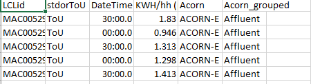


The remaining customers (~4500) were on a:
* Flat rate tariff of = 14.228 pence/kWh

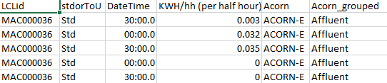


The `low-carbon-london-data-168-files` is about 10.7 GB (11,585,294,336 bytes) once unzipped. 168 seprate `.csv` files, each containing 1 million rows, and about ~67MB in size.

#### 2. Indoor Air Quality Data
This dataset I obtained from [Kaggle](https://www.kaggle.com/mvolkerts/home-office-airpi). The data was obtained using an **AirPi** ([Link](http://airpi.es/)) which was placed in a home office.
* Initial size = 1.67 MB (1,752,128 bytes)

After deleting columns associated with light, volume and extra temperature reading, I was left with:
* Final size = 1.21 MB (1,273,856 bytes)

For how the data looks and units used, see image below.

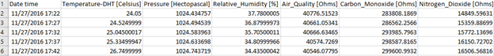


#### 3. Actual Address Data
This data set I obtained from [Seattle GeoData](https://data-seattlecitygis.opendata.arcgis.com/datasets/36a74a49c2fd45f7918706b0f6e8be3e_1). I obtained a `.csv` list of 10000 actual home addresses together with their longitude and latitude.

After using real data and simulating more (based on the real energy and airquality datasets), I was able to create a Schema based dataset. The process is detailed in the image below.

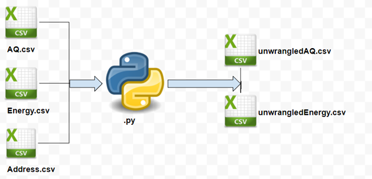


Directories `data/aq_sample_50_of_3600` and `data/energy_sample_50_of_3600` each contain **3600 `.csv`** files. Total size is **8.90 GB (9,565,413,376 bytes)**
For **aq**, the file looks like:

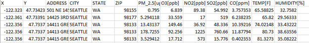


For **energy**, the file looks like:

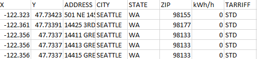


#### 4. Other Possible Sources of Data
1. https://data.open-power-system-data.org/household_data/
2. https://data.austintexas.gov/resource/d9pb-3vh7.csv
3. https://www.kaggle.com/epa/carbon-monoxide


## Pipeline
Generally, **IoT Dapse's** overall architecture is:

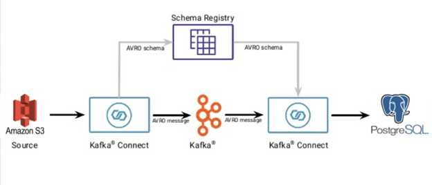


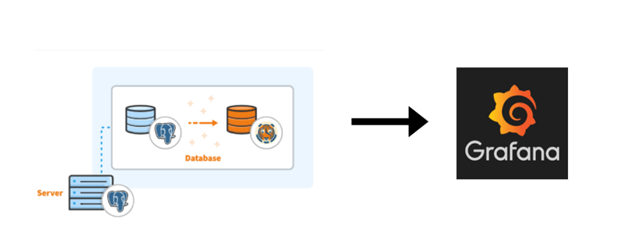


## Interfaces
I used docker for the setup. The `.yml` are the ones I used to set up the UIs. The `land.yml` and `landdop-docker-compose.yml` were good, but it's much better to have the `lenses.yml`, which is essentially landoop+.
#### Kafka Manager UI and Kafka Topics UI
Setup using `interfaces\kafka-manager-docker-compose.yml` and `interfaces\kafka-topics-ui-docker-compose.yml`. 

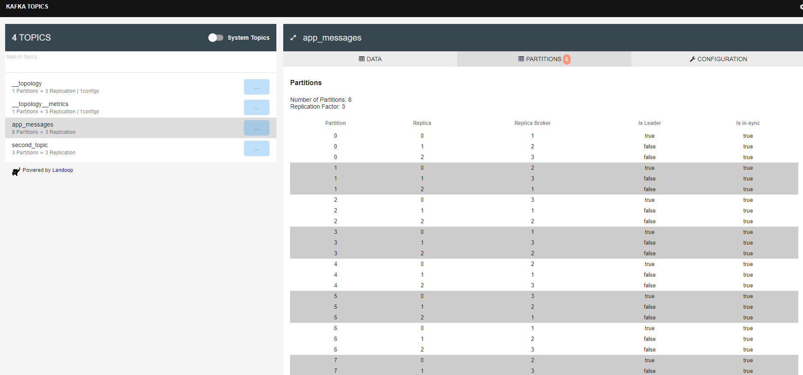


#### Zoonavigator UI
Setup using `interfaces\zoonavigator-docker-compose.yml`

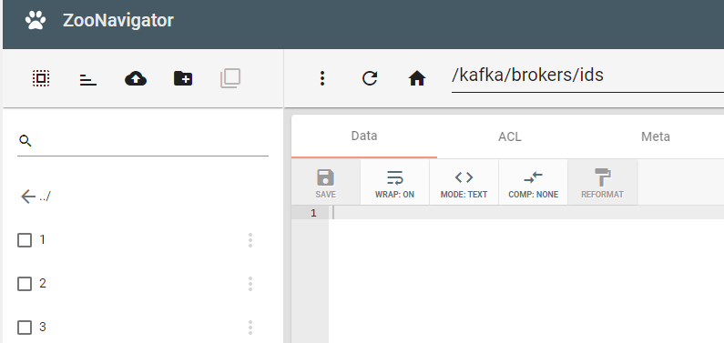


#### Lenses io UI
Setup using `interfaces\lenses.yml`

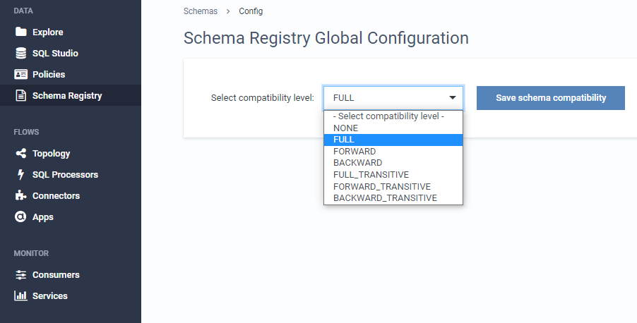


##### Other considerations
These are other alternatives to the UI's above, and they are somewhat much easier to work with since they don't necessarily involve too much manual configuration of your cluster. 
###### 1. Confluent Cloud
###### 2. Amazon MSK
###### 3. Confluent Platform installation using ansible

The only reason I was adamant to use them was because of the hourly charge for running and maintaining a cluster, together with other unforseen charges. 


## Python
##### `.py files`
In the `./python_gh/` directory, are some of the python files I used. I used `streamer.py` for the hail mary streaming, which was meant to simulate a set of devices for a single household, streaming data corresponding to the data in the aforementioned `.csv` files. I was registering the timestamp when the data was consumed, then I would insert the data into a postgreSQL+Timescale DB table, as seen from the connection settings in the `.py` files. `config.ini` is not included, for obvious reasons.

##### `schema directory`
Contains the `schema.avsc` schema for the serializing and deserializing the produced and consumed messages.
```java:

{
   "type": "record",
   "namespace": "both.avro",
   "name": "both",
   "doc": "Both air q and e",
   "fields": [
      {
         "name": "X",
         "type": ["null", "string", "double"],
         "default": null
      },
      {
         "name": "Y",
         "type": ["null", "string", "double"],
         "default": null
      },
      {
         "name": "ADDRESS",
         "type": ["null", "string"],
         "default": null
      },
      ...
      {
         "name": "HUMIDITY",
         "doc": "Measured as a percentage (%)",
         "type": ["null", "string", "int", "double"],
         "default": null
      },
      {
         "name": "ENERGY_CONSUMED",
         "doc": "Values are in Kilowatts consumed per hour(kWh/h)",
         "type": ["null", "string", "int", "double"],
         "default": null
      },
      {
         "name": "TARRIFF",
         "doc": "Units are in degrees Farenheit (F)",
         "type": ["null", "string"],
         "default": null
      }
   ]
}
```


## Database

##### 1. DB schema used
```SQL:
"""CREATE TABLE IF NOT EXISTS sensor_data (
        Time TIMESTAMP,
        X NUMERIC,
        Y NUMERIC,
        Address TEXT,
        City TEXT,
        State TEXT,
        Zip  INTEGER,
        PM_2_5   NUMERIC,
        O3 INTEGER,
        NO2 NUMERIC,
        SO2  NUMERIC,
        CO NUMERIC,
        Temperature NUMERIC,
        Humidity NUMERIC,
        Energy NUMERIC
        );"""
```

#### 2. PostgreSQL + Timescale DB

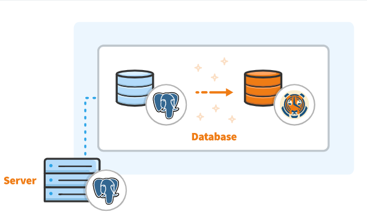


#### 3. Schemaless data table

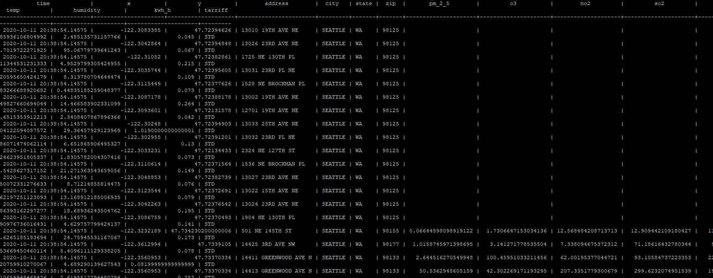


#### 4. Streaming insertion into the DB

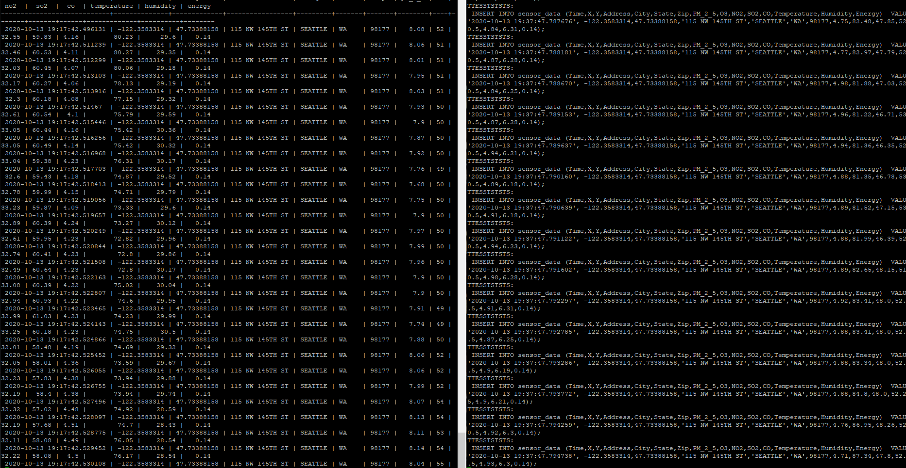


## Suggestions
Getting started with Kafka was not necessarily easy. If you happen to have trouble following through the `./setup/` directory, a source of resource is *Udemy*, *Coursera*, etc. These platforms are a treasure trove of information if you happen to have an insatiable appetite for knowing things!


Additionally, there are some great youtube videos by **Stephane Maarek** and **Robin Moffatt**, both of who helped me come to have a better undertsanding of what was happening under the hood.

***Drink Coffee && Keep Coding***
