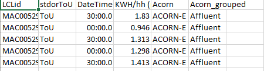
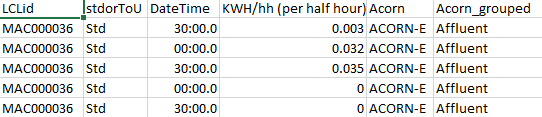
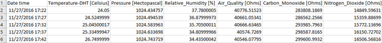
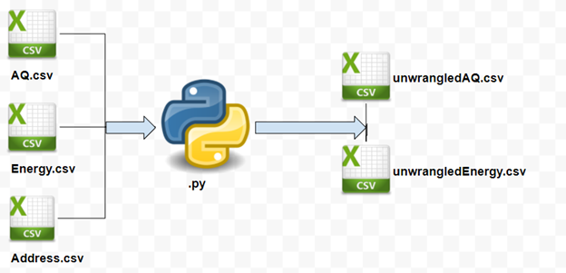
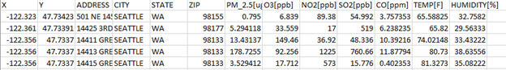
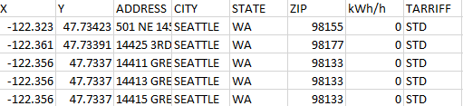

# INSIGHT_DAPSE
Data Analytics Platform with Schema Evolution ([DAPSE](https://github.com/users/stevexenios/projects/6))

## Table of Contents
1. [Data](README.md#data)
1. [Pipeline](README.md#pipeline)
1. [Managers](README.md#managers)

## Data
### 1. Utility Data
This dataset I obtained from [London Datastore](https://data.london.gov.uk/dataset/smartmeter-energy-use-data-in-london-households). It comprises energy consumption readings from a sample of 5,567 London Households, collected between Nov 2011-Feb 2014.

Readings were taken every 0.5 hour, and energy consumption is in kWh/half-hour. About 1100 customers were subjected to a dynamic time of use (dToU) energy prices: 
* High   = 67.20p/kWh
* Low    =  3.99p/kWh
* Normal = 11.76p/kWh

The remaining customers (~4500) were on a:
* Flat rate tariff of = 14.228 pence/kWh

The `low-carbon-london-data-168-files` is about 10.7 GB (11,585,294,336 bytes) once unzipped. 168 seprate `.csv` files, each containing 1 million rows, and about ~67MB in size.

### 2. Indoor Air Quality Data
This dataset I obtained from [Kaggle](https://www.kaggle.com/mvolkerts/home-office-airpi). The data was obtained using an **AirPi** ([Link](http://airpi.es/)) which was placed in a home office.

* Initial size = 1.67 MB (1,752,128 bytes)

After deleting columns associated with light, volume and extra temperature reading, I was left with:

* Final size = 1.21 MB (1,273,856 bytes)

For how the data looks and units used, see image below.

### 3. Actual Address Data
This data set I obtained from [Seattle GeoData](https://data-seattlecitygis.opendata.arcgis.com/datasets/36a74a49c2fd45f7918706b0f6e8be3e_1). I obtained a `.csv` list of 10000 actual home addresses together with their longitude and latitude.

After using real data and simulating more (based on the real energy and airquality datasets), I was able to create a Schema based dataset. The process is detailed in the image below.

Directories `IMAGES/SCHEMA/AQ` and `IMAGES/SCHEMA/ENERGY` each contain 3600 `.csv` files. Total size is **8.90 GB (9,565,413,376 bytes)**

For AQ, the file looks like:

For ENERGY, the file looks like:

### 4. Other Possible Sources of Data
1. https://data.open-power-system-data.org/household_data/
2. https://data.austintexas.gov/resource/d9pb-3vh7.csv
3. https://www.kaggle.com/epa/carbon-monoxide

## Ingestion
